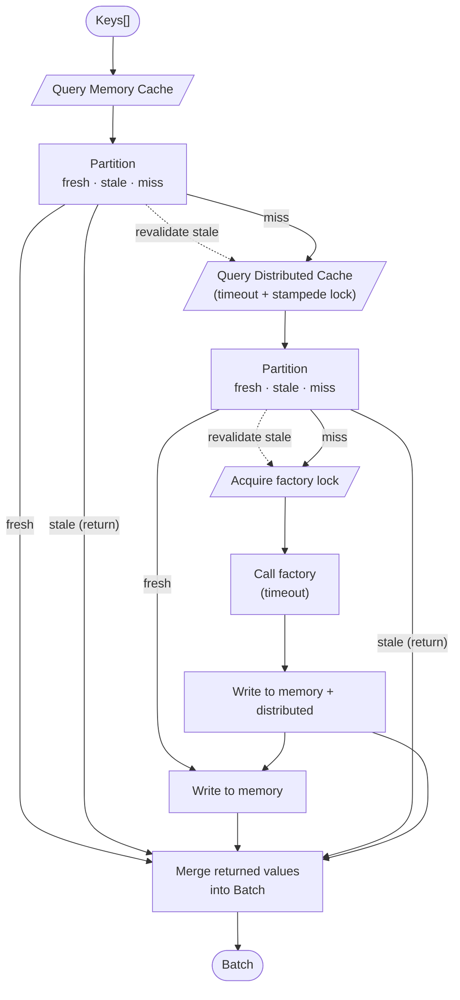

# Tiered Cache

> A Typescript cache library supporting an in-memory and distributed layer at the same time

## Features

- **Tiered Caching**: Automatically falls back to distributed cache if the memory cache misses.
  - **Memory Cache**: Fast in-memory caching for quick access.
  - **Distributed Cache**: Supports Redis and other distributed cache systems.
- **TypeScript Support**: Fully typed for better development experience.
- **Built on top of KeyV**: Utilizes KeyV to handle the low level caching API per cache layer.
- **High Performance Features**: Because you don't want a dumb cache layer:
  - **Batch Operations**: Supports batch get and set operations for better performance.
  - **Stampede Protection**: Prevents multiple similar requests from firing at the same time.
    - **Cache Level**: Does not send multiple requests to the distributed cache for the same key.
    - **Factory Level**: Prevents multiple requests to the factory function for the same key.
  - **Strict Timeouts**: Configurable strict timeouts for cache operations to ensure speed.
    - **Soft Timeouts**: Returns cached data even if the operation times out, allowing for a fallback mechanism.
    - **Hard Timeouts**: Throws an error if the operation exceeds the configured timeout, allowing your code to handle it quickly, but gracefully.
  - **Soft Expiry**: Supports soft expiry for cache entries, allowing them to be used in case of a failures or timeouts.
  - **Background updates**: Allows for updating cache entries in the background without blocking the main thread.

## Batch Get flow

The batch get flow is probably the most complex part of the cache, so here's a detailed explanation of how it works:

