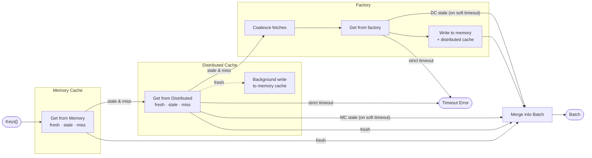

# Tiered Cache

> A Typescript cache library supporting an in-memory and distributed layer at the same time

## Features

- In-memory and distributed tier caching
- Batch operations
- Soft expiry and strict timeouts
- Background updates on timeout

## Batch Get flow

The batch get flow is probably the most complex part of the cache.

Here's a detailed diagram of how it works:

Dotted lines indicate background operations that do not block the main flow.
